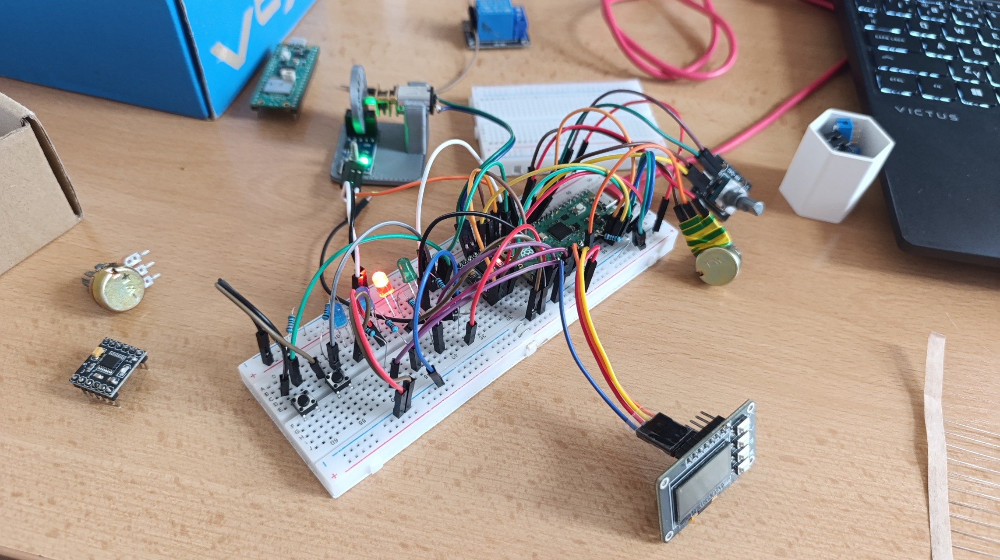
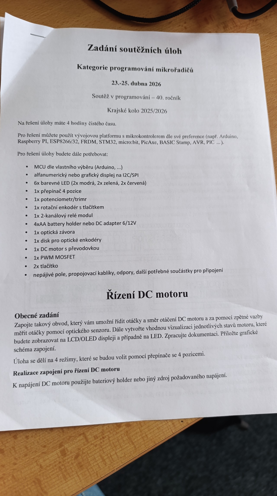
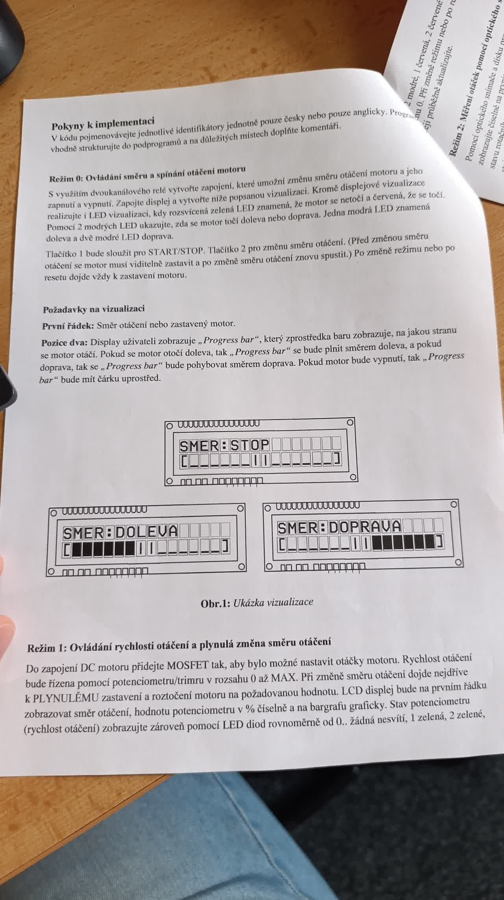
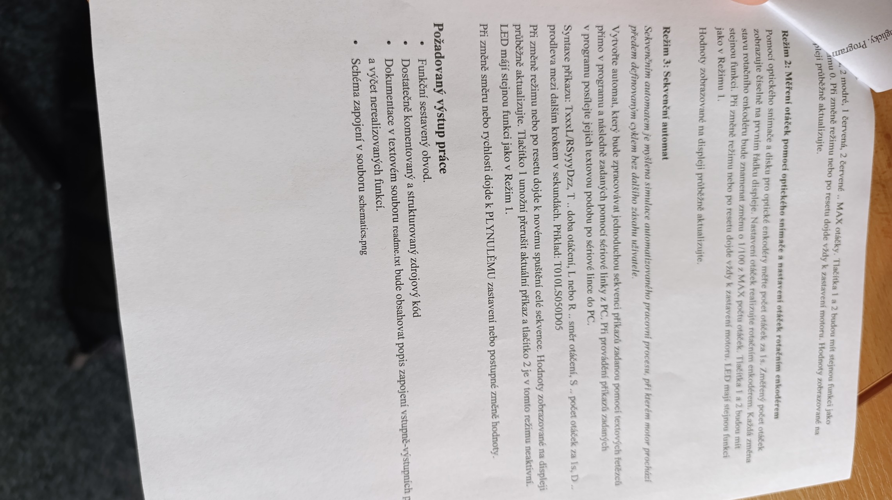

# DC Motor Controller - Competition Repository

This directory contains the codebase for an MCU programming competition (40th year, Regional round 2025/2026), where I achieved 1st place. 

## Competition Context & Self-Reflection

### Why Raspberry Pi Pico & MicroPython?
My choice of platform for this regional round was highly strategic. In the previous district round, I competed using a traditional C++ approach (Arduino MKR) and placed 2nd. The winner of that round used a Raspberry Pi Pico with MicroPython, demonstrating how Python's flexibility and significantly lower lines of code (LOC) enabled much faster rapid prototyping under time pressure. Learning from this, I switched to the Pico to maximize my development speed for this round.

### The Competition Reality
The original code (`mode0.py`, `mode1.py`, `mode2.py`) was written rapidly under a strict 4-hour time constraint. Since the use of AI tools (other than offline and basic internet search) was prohibited during the competition, I strategically utilized AI *before* the competition to pre-generate hardware abstraction libraries (now in `/lib`) to speed up my development, based on the components list we got beforehand, because unlike arduino ecosystem, rpi pico doesnt offer basic hardware libraries.

While the solution secured 1st place, it only scored 17/70 points. After reviewing the official assignment retroactively, the reasons for the point deductions are clear:
1. **Hardware Deviations:** The assignment specifically requested using a 2-channel relay for direction and a MOSFET for PWM speed control. I used a DRV8833 H-Bridge motor driver instead, because judge aprooved it beforehand, as it delivers the same result. While functionally superior and more modern, it didn't strictly follow the component constraints. 
2. **Missing Modes & Features:** "Mode 3" (Serial command parser and sequential state machine) was not implemented. Smooth acceleration/deceleration and the complex 6-LED speed bargraph were also omitted due to time limits. 
3. **Missing Deliverables:** A 4-position switch was not used for mode selection (separate scripts were run instead), because implementing it would waste at least 8 wires, which i ran out of.
Also the `schematics.png` file was missing.

### The `refactored_v2` Architecture
As a learning exercise and for professional presentation, I have created the `refactored_v2` directory. It addresses the poor software architecture (anti-patterns) present in the original competition code:
- **Removed Blocking Delays:** Replaced `time.sleep()` with non-blocking `time.ticks_ms()` logic.
- **State Machine Implementation:** Encapsulated motor state and hardware updates into a clean `MotorController` class, eliminating messy global variables.
- **Hardware Decoupling:** Solved DRY violations by centralizing hardware toggles.

### Relevant Links (Context)
*Please note: The competition organizers do not maintain these websites well. There are no results for 2026, or the specifications available, and the linked sites are heavily outdated.*
- [Soutěže v programování](https://programuj.si/souteze/programovani)
- [SP STV](http://sp.stv.cz/)

## Pinout
Please refer to `doc.md` for the exact GPIO pin mapping used on the Raspberry Pi Pico.

## Hardware & 3D Printed Parts
To mount the components securely for the competition, custom 3D models were designed in Fusion 360:
- `assets/encoder_wheel_N20.stl`: A custom encoder disk designed for the LM393 optical sensor to measure motor RPM.
- `assets/holder.stl`: A custom mount for the DC motor and the LM393 sensor.

These STL files are small enough to be tracked directly in this repository within the `assets/` folder, allowing anyone to replicate the physical setup.

## Gallery
*(physical build and the assigment)*

> the final circuit

> top left in the picture is the holder used with the N20-motor + wheel and LM393 sensor

